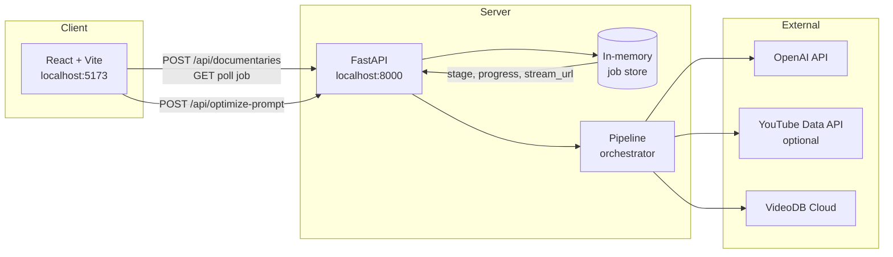
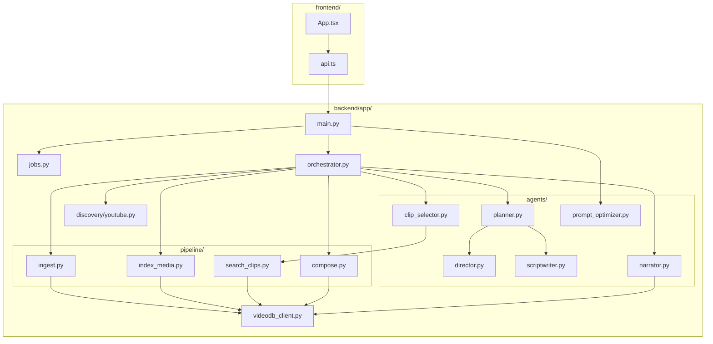
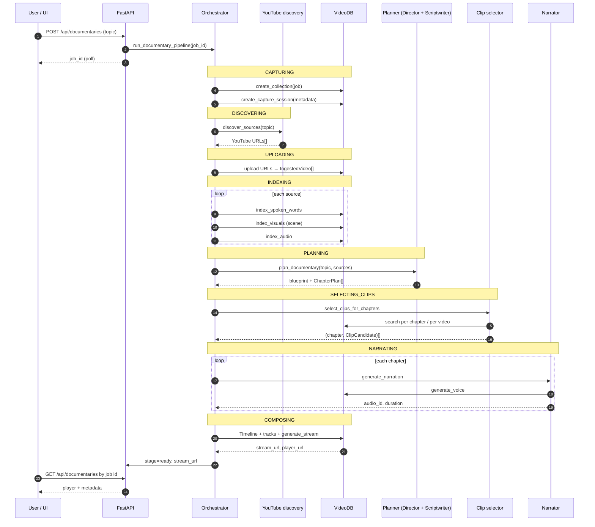
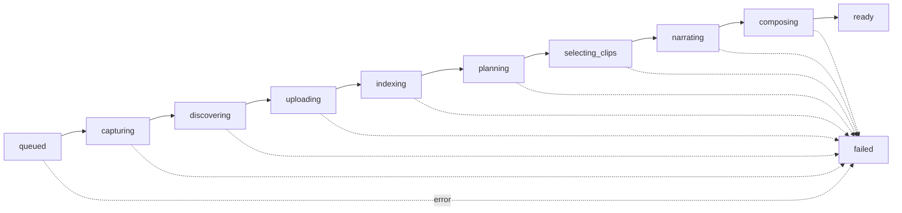
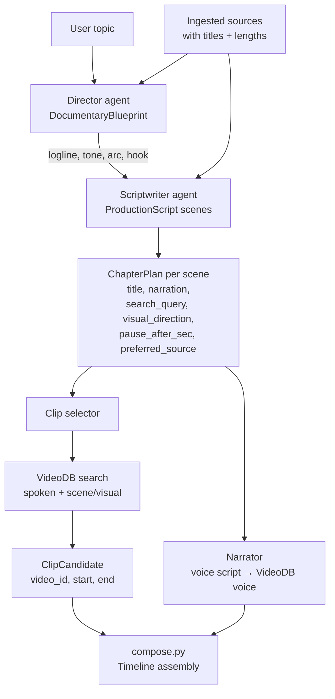
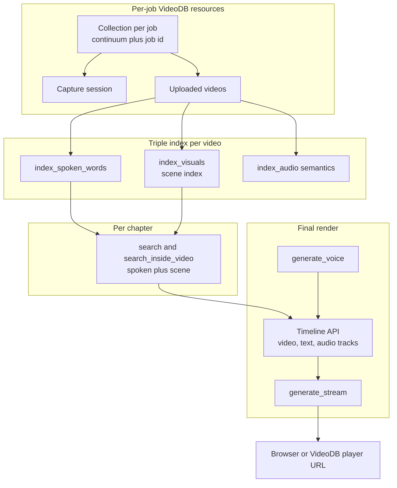
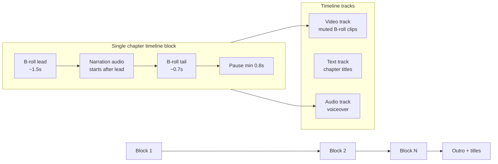
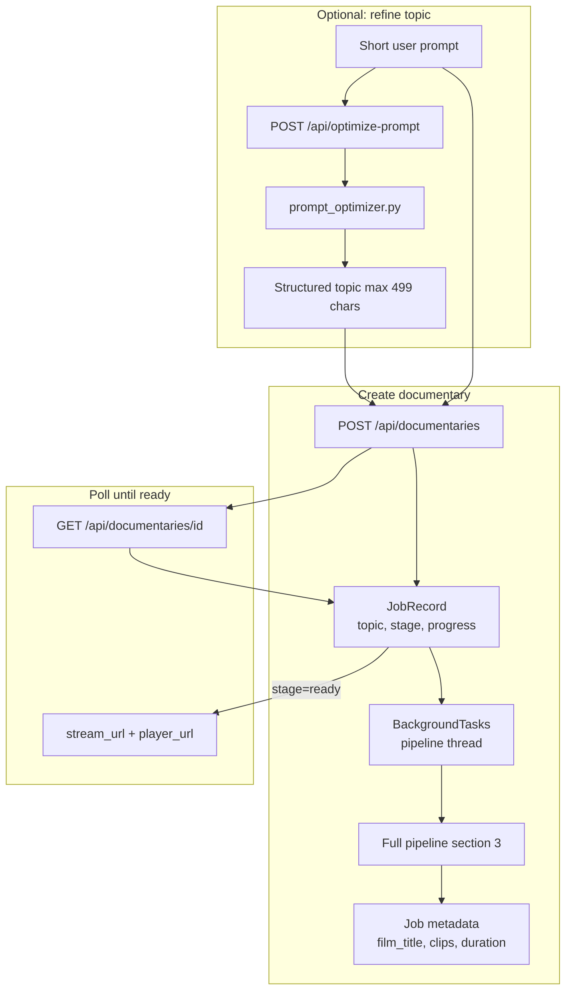
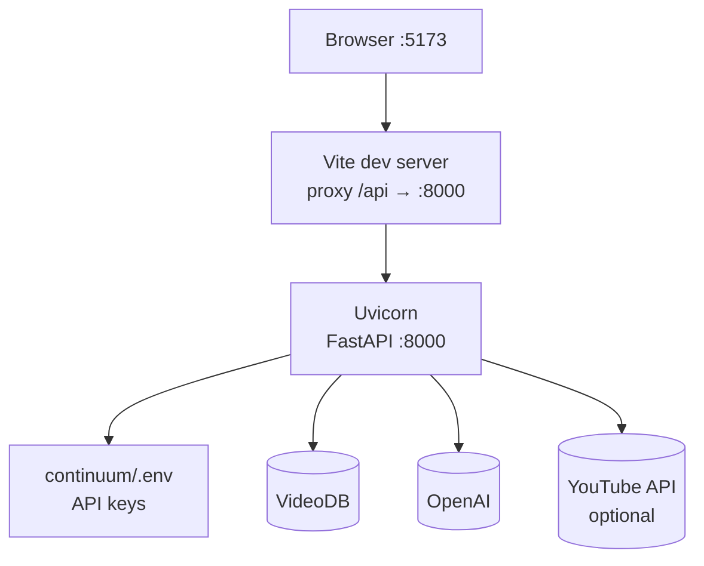

# Continuum — Architecture

This document describes how Continuum is structured end to end: client, API, agent layer, pipeline stages, and VideoDB integration.

For setup and runtime instructions, see [README.md](./README.md).

### How to view the flowcharts

The diagrams are **[Mermaid](https://mermaid.js.org)** code inside ` ```mermaid ` blocks. If you only see text like `flowchart LR` and arrows (`-->`), you are in **source view**, not rendered preview.

| Where you open the file | What to do |
|-------------------------|------------|
| **Cursor / VS Code** | Open `ARCHITECTURE.md` → **Markdown: Open Preview** (`Ctrl+Shift+V` on Windows, `Cmd+Shift+V` on Mac). If charts still don’t render, install the extension **“Markdown Preview Mermaid Support”** and preview again. |
| **GitHub** | Push the repo and open the file on github.com — Mermaid renders automatically in `.md` files. |
| **Browser (any)** | Copy one ` ```mermaid ` … ` ``` ` block → paste at [mermaid.live](https://mermaid.live) → export PNG/SVG. |

---


## 1. System overview

Continuum is a **three-tier** system: a React UI polls a FastAPI backend, which orchestrates OpenAI agents and the VideoDB SDK to produce a streamed documentary.



| Layer | Responsibility |
|-------|----------------|
| **Frontend** | Topic input, prompt optimization, stage progress, video player |
| **API** | REST endpoints, background task scheduling, CORS |
| **Orchestrator** | Single linear pipeline per `job_id` |
| **Agents** | Creative planning and narration copy (OpenAI) |
| **Pipeline modules** | Ingest, index, search, compose (VideoDB SDK) |

---

## 2. Component architecture



---

## 3. Documentary pipeline (sequence)

Each job runs **one background thread** through these stages. Progress and `stage` are written to the job store after each step.



### Pipeline stages (UI labels)



---

## 4. Creative agent flow

Planning is intentionally **split** and runs **after** indexing so scripts reference real source titles.



| Agent / module | Input | Output |
|----------------|-------|--------|
| **Director** | Topic + source summaries | `DocumentaryBlueprint` |
| **Scriptwriter** | Blueprint + topic + sources | Scenes with narration & search hints |
| **Planner** | Orchestrates director → scriptwriter | `ChapterPlan[]` |
| **Clip selector** | Chapters + collection + sources | Best non-overlapping clip per chapter |
| **Narrator** | Chapter narration text | VideoDB `audio_id` + duration |

---

## 5. VideoDB integration map



---

## 6. Timeline composition (one scene block)

The composer builds **sequential scene blocks** so narration never overlaps between chapters.



**Design intent:** B-roll plays under narration with controlled lead-in/out; a gap (`pause_after_sec`) separates chapters before the next block starts.

---

## 7. Request / data flow (optimize vs create)



---

## 8. Deployment view (local dev)



---

## Key architectural decisions (summary)

| Decision | Rationale |
|----------|-----------|
| Plan **after** index | Search queries match real uploaded media |
| One **collection** per job | Isolated corpus; easy debugging in VideoDB console |
| **Triple** index | Different retrieval modes for documentary editing |
| **Sequential** timeline blocks | Avoid overlapping narration and dual-audio issues |
| **In-memory** jobs | Hackathon simplicity; no DB migrations |
| Background **thread** per job | Non-blocking API; UI polls for progress |

---

*Continuum — Give agents eyes and ears. Let them direct something real.*
