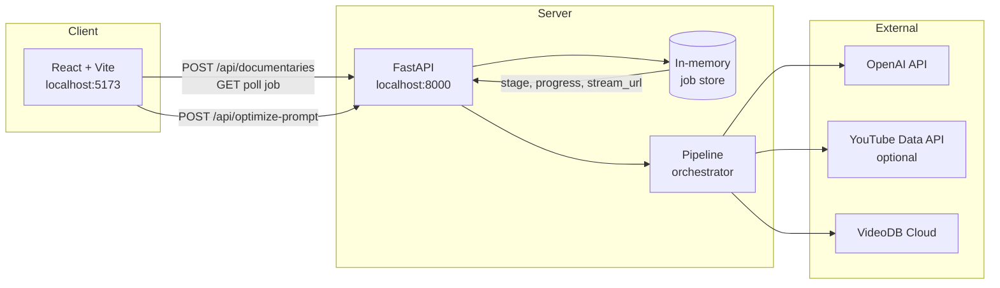
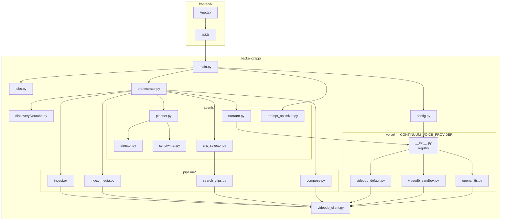
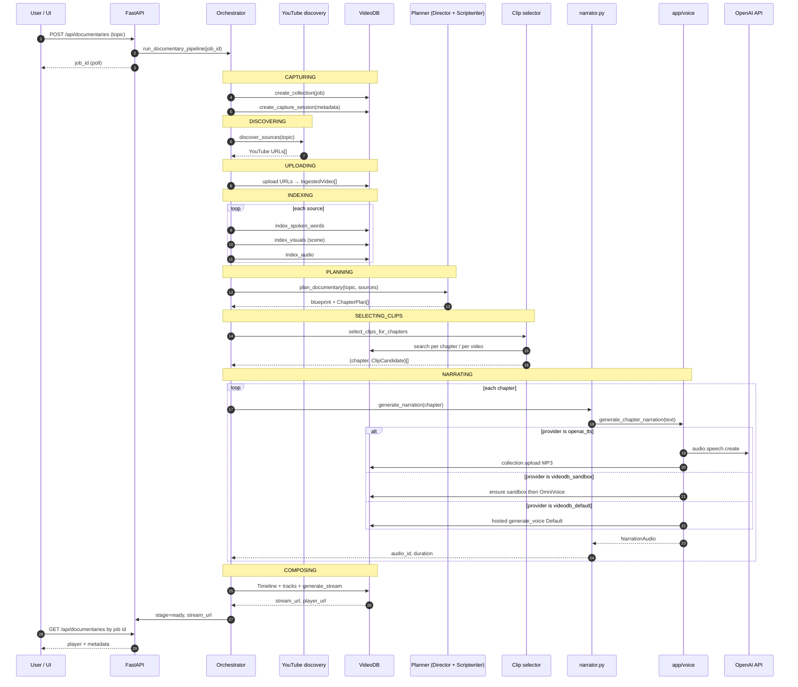
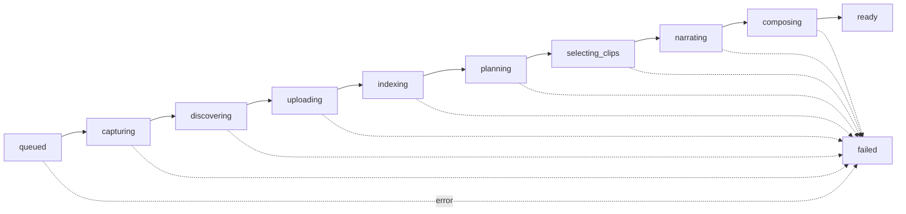
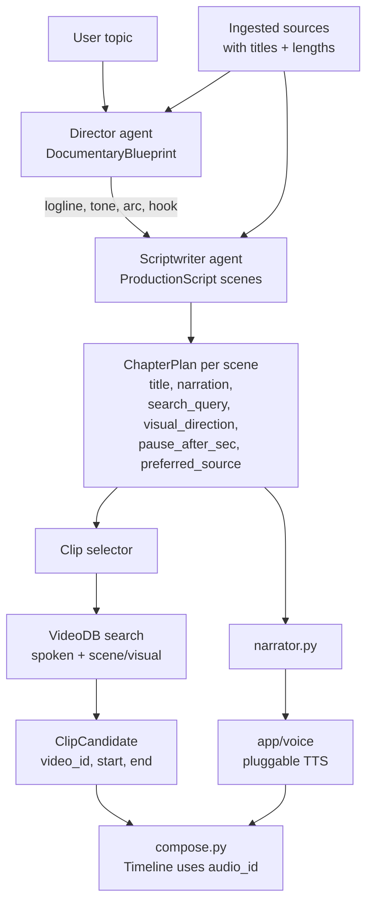
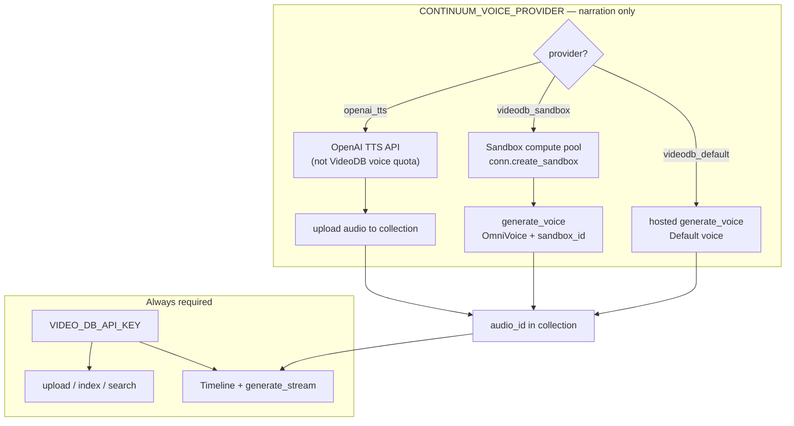
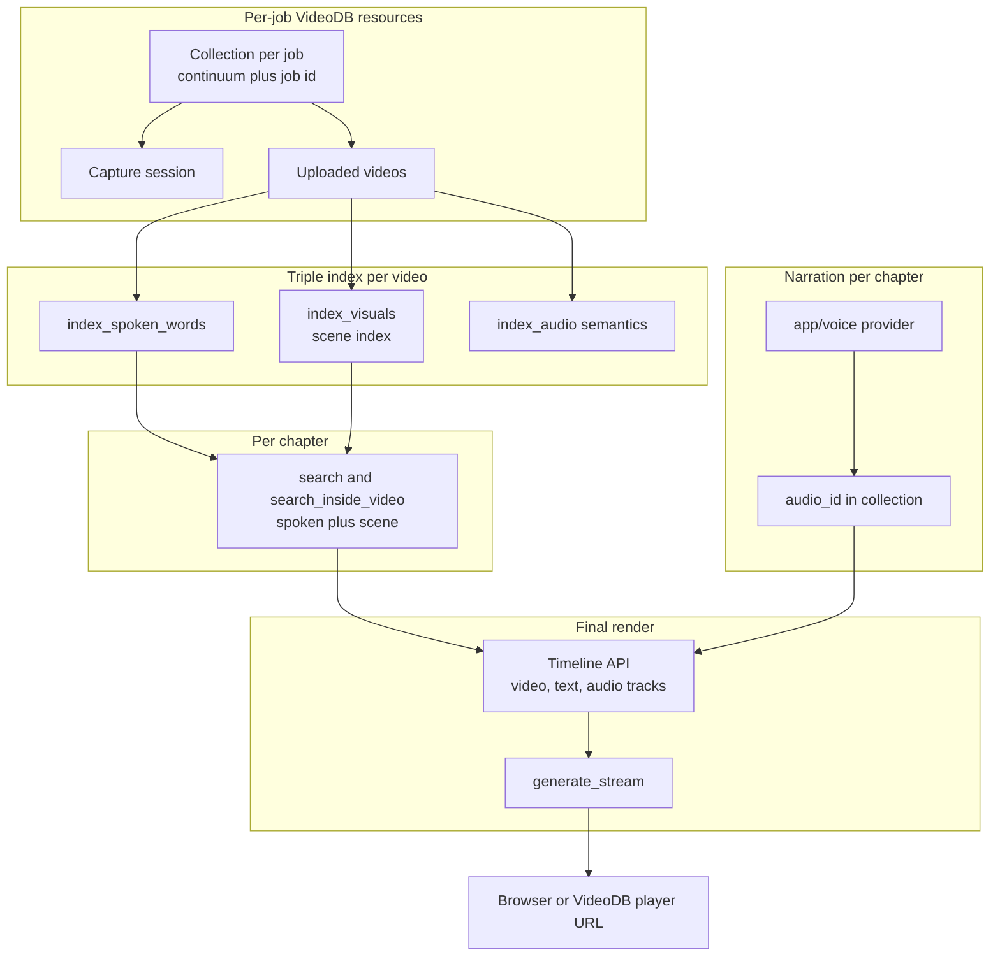
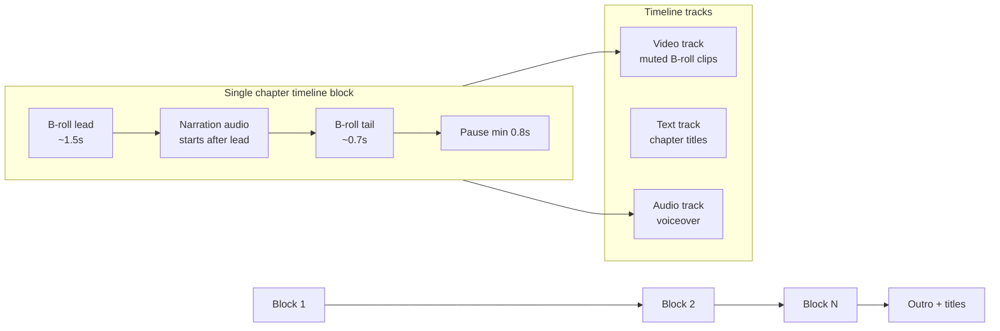
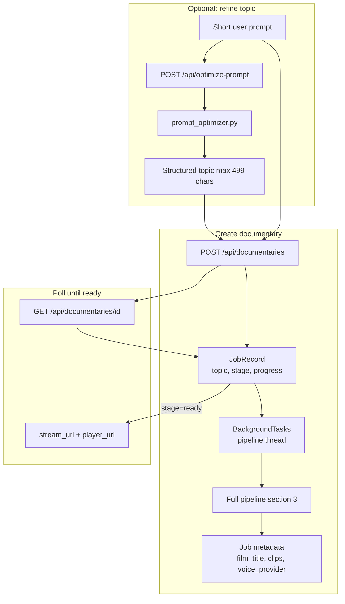
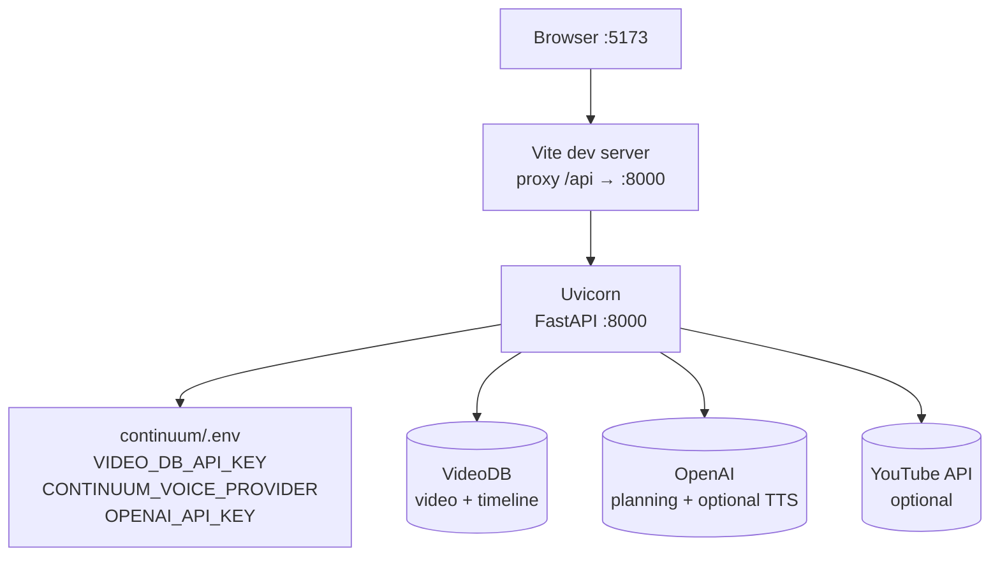

# Continuum — Architecture

This document describes how Continuum is structured end to end: client, API, agent layer, pipeline stages, **pluggable voice generation**, and VideoDB integration.

For setup and runtime instructions, see [README.md](./README.md).  
For switching narration backends (OpenAI TTS vs VideoDB Sandbox vs hosted voice), see [README — Voice generation](./README.md#voice-generation-switch-provider).

### How to view the flowcharts

The diagrams are **[Mermaid](https://mermaid.js.org)** code inside ` ```mermaid ` blocks. If you only see text like `flowchart LR` and arrows (`-->`), you are in **source view**, not rendered preview.

| Where you open the file | What to do |
|-------------------------|------------|
| **Cursor / VS Code** | Open `ARCHITECTURE.md` → **Markdown: Open Preview** (`Ctrl+Shift+V` on Windows, `Cmd+Shift+V` on Mac). If charts still don’t render, install the extension **“Markdown Preview Mermaid Support”** and preview again. |
| **GitHub** | Push the repo and open the file on github.com — Mermaid renders automatically in `.md` files. |
| **Browser (any)** | Copy one ` ```mermaid ` … ` ``` ` block → paste at [mermaid.live](https://mermaid.live) → export PNG/SVG. |

---


## 1. System overview

Continuum is a **three-tier** system: a React UI polls a FastAPI backend, which orchestrates OpenAI agents and the VideoDB SDK to produce a streamed documentary.



| Layer | Responsibility |
|-------|----------------|
| **Frontend** | Topic input, prompt optimization, stage progress, video player |
| **API** | REST endpoints, background task scheduling, CORS |
| **Orchestrator** | Single linear pipeline per `job_id` |
| **Agents** | Creative planning and narration **scripts** (OpenAI) |
| **`app/voice/`** | Pluggable TTS: produces VideoDB `audio_id` per chapter (see §5) |
| **Pipeline modules** | Ingest, index, search, compose (VideoDB SDK) |

**Important:** `VIDEO_DB_API_KEY` is always required for video ingest, index, search, and timeline. **Narration** is a separate switch (`CONTINUUM_VOICE_PROVIDER`) — it does not replace the API key.

---

## 2. Component architecture



---

## 3. Documentary pipeline (sequence)

Each job runs **one background thread** through these stages. Progress and `stage` are written to the job store after each step.



### Pipeline stages (UI labels)



---

## 4. Creative agent flow

Planning is intentionally **split** and runs **after** indexing so scripts reference real source titles.



| Agent / module | Input | Output |
|----------------|-------|--------|
| **Director** | Topic + source summaries | `DocumentaryBlueprint` |
| **Scriptwriter** | Blueprint + topic + sources | Scenes with narration & search hints |
| **Planner** | Orchestrates director → scriptwriter | `ChapterPlan[]` |
| **Clip selector** | Chapters + collection + sources | Best non-overlapping clip per chapter |
| **`narrator.py`** | `ChapterPlan` | Delegates to `app/voice/` |
| **`app/voice/`** | Narration text + collection | `NarrationAudio` (`audio_id`, duration, provider) |

---

## 5. Voice generation (pluggable providers)

Narration is **not** hard-wired to a single `collection.generate_voice` call. The orchestrator always ends up with a VideoDB **`audio_id`** for timeline compose; **how** that audio is created is selected by `CONTINUUM_VOICE_PROVIDER` in `continuum/.env` (resolved in `config.py` → `app/voice/__init__.py`).

### Three providers (one active at a time)

| Provider ID | Module | What it does |
|-------------|--------|----------------|
| `openai_tts` | `voice/openai_tts.py` | OpenAI Speech API → temp MP3 → `collection.upload` → `audio_id` |
| `videodb_sandbox` | `voice/videodb_sandbox.py` | OmniVoice on **VideoDB Sandbox** GPU pool (`SandboxModel.OMNIVOICE`, `sandbox_id=...`) |
| `videodb_default` | `voice/videodb_default.py` | VideoDB **hosted** voice (`voice_name=Default`, plan GenAI quota) |

Verify at runtime: `GET /health` → `voice_provider`, `voice_provider_label`.

### Sandbox vs API key vs OpenAI (common reviewer question)



| Concept | Meaning |
|---------|---------|
| **VideoDB API key** | Authenticates all SDK calls (collections, indexing, search, timeline, uploads). |
| **Sandbox** | Optional **GPU compute rental** inside VideoDB for self-hosted models (OmniVoice, FLUX, VLMs). Created via `conn.create_sandbox()`; pass `sandbox_id` into `generate_voice`. **Not** a substitute for the API key. |
| **Hosted `videodb_default`** | VideoDB runs TTS on their side; subject to plan voice caps. |
| **`openai_tts`** | TTS happens on OpenAI; Continuum only **stores** the result in VideoDB for the same compose path. |

**Hackathon demo path:** `videodb_sandbox` (deep VideoDB + bypasses default voice caps).  
**Evaluation / no VideoDB voice credits:** `openai_tts`.

### Code path (read order for reviewers)

```text
orchestrator.py
  → agents/narrator.py::generate_narration()
  → voice/__init__.py::generate_chapter_narration()
  → voice/<provider>.py::generate()
  → returns NarrationAudio(audio_id, duration_sec, provider)
  → compose.py uses narration_audio_id on Timeline
```

Sandbox-specific logic (`ensure_sandbox_id`, `wait_for_ready`, cached sandbox ID) lives only in `voice/videodb_sandbox.py`. Helper script: `scripts/create_sandbox.py`.

---

## 6. VideoDB integration map



Narration enters the timeline as a normal VideoDB audio asset regardless of provider; only the **creation path** differs (see §5).

---

## 7. Timeline composition (one scene block)

The composer builds **sequential scene blocks** so narration never overlaps between chapters.



**Design intent:** B-roll plays under narration with controlled lead-in/out; a gap (`pause_after_sec`) separates chapters before the next block starts.

---

## 8. Request / data flow (optimize vs create)



---

## 9. Deployment view (local dev)



When `CONTINUUM_VOICE_PROVIDER=openai_tts`, OpenAI is used at **narrating** time only; VideoDB still handles all video operations.

---

## Key architectural decisions (summary)

| Decision | Rationale |
|----------|-----------|
| Plan **after** index | Search queries match real uploaded media |
| One **collection** per job | Isolated corpus; easy debugging in VideoDB console |
| **Triple** index | Different retrieval modes for documentary editing |
| **Sequential** timeline blocks | Avoid overlapping narration and dual-audio issues |
| **Pluggable voice** (`app/voice/`) | Judges can run without VideoDB voice quota; same compose path via `audio_id` |
| **Sandbox for demo** | `videodb_sandbox` routes OmniVoice to dedicated compute, not hosted GenAI caps |
| **In-memory** jobs | Hackathon simplicity; no DB migrations |
| Background **thread** per job | Non-blocking API; UI polls for progress |

---

*Continuum — Give agents eyes and ears. Let them direct something real.*
