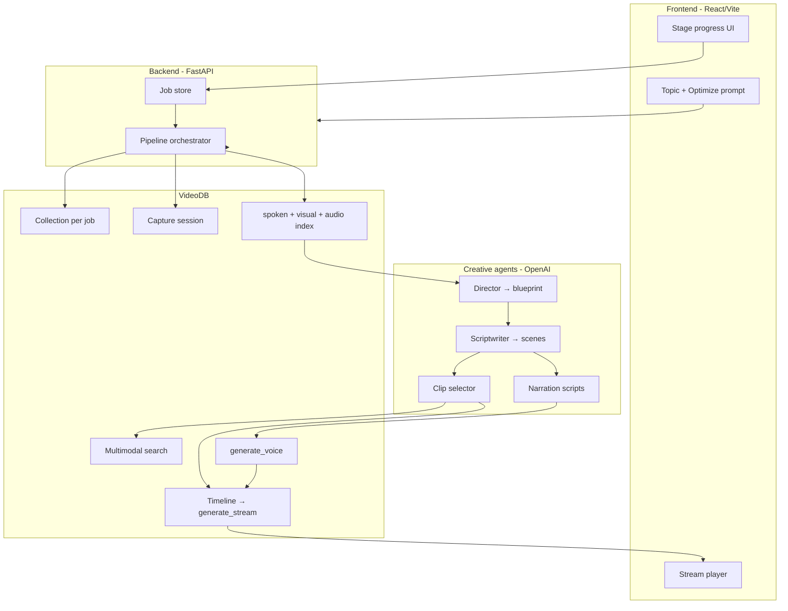

# 🎬Continuum

**An agentic documentary studio powered by [VideoDB](https://videodb.io).**

*In **simple terms** it builds Mini-Documentary videos based on your inputs/prompts.*

Continuum turns a prompt on a topic into a watchable mini-documentary assembled from real YouTube archival footage—not AI-generated pixels. Agents **see** footage (visual indexing), **hear** it (spoken-word and audio semantics), **plan** a film (director + scriptwriter), **retrieve** evidence-backed clips per scene, **narrate** with VideoDB voice, and **compose** a broadcast-style timeline with programmatic editing.

Built for the **VideoDB Global Online Hackathon — Give Agents Eyes and Ears**.

---

## Table of contents

- [What problem does Continuum solve?](#what-problem-does-continuum-solve)
- [Demo at a glance](#demo-at-a-glance)
- [Architecture](#architecture) — detailed flowcharts in [ARCHITECTURE.md](./ARCHITECTURE.md)
- [VideoDB APIs used](#videodb-apis-used)
- [Prerequisites](#prerequisites)
- [**Local setup (step by step)**](#local-setup-step-by-step)
- [Running the app](#running-the-app)
- [How it works (technical decisions)](#how-it-works-technical-decisions)
- [Project structure](#project-structure)
- [Configuration reference](#configuration-reference)
- [API overview](#api-overview)
- [Known limitations](#known-limitations)
- [Why films are not 5–10 minutes long](#why-films-are-not-510-minutes-long)
- [Smoke test](#smoke-test)
- [Troubleshooting](#troubleshooting)
- [License](#license)

---

## What problem does Continuum solve?

Most “AI video” tools generate synthetic footage or stitch a single clip with a generic voiceover. Continuum takes a different path aligned with the hackathon theme:

| Capability | How Continuum does it |
|------------|------------------------|
| **Eyes** | `index_visuals` + scene search for B-roll that matches director intent |
| **Ears** | `index_spoken_words` + `index_audio` for facts, names, and claims in sources |
| **Hands** | Multimodal search per chapter, `generate_voice`, and `Timeline` assembly |

You describe a topic (e.g. *Indian moon landing*). Continuum discovers and ingests related YouTube sources, indexes them in VideoDB, plans chapters **after** it knows what footage exists, selects non-overlapping clips per scene, generates narration, and renders a stream you can play in the browser or VideoDB console.

---

## Demo at a glance

1. Open the UI → enter a topic (you can use **Optimize** to refine your prompt).
2. Click **Create documentary** → watch pipeline stages update.
3. When status is **Ready**, play the embedded stream / open the VideoDB player link.

Typical end-to-end time: **roughly 5–15 minutes** depending on source count, video length, and VideoDB indexing load.

---

## Architecture



**Pipeline stages (in order):**

`capturing` → `discovering` → `uploading` → `indexing` → `planning` → `selecting_clips` → `narrating` → `composing` → `ready`

---

## VideoDB APIs used

| User-visible step | VideoDB capability | Purpose |
|-------------------|-------------------|---------|
| Start job | `Collection` (per job) | Isolated corpus per documentary |
| Capturing | `create_capture_session` | Research session metadata (hackathon Capture API) |
| Uploading | Ingest YouTube URLs | Build multi-source archive |
| Indexing | `index_spoken_words`, `index_visuals`, `index_audio` | Eyes + ears on every source |
| Selecting clips | `search` (spoken, scene/visual, per-video) | Evidence-backed B-roll per chapter |
| Narrating | `generate_voice` | Chapter voiceover audio assets |
| Composing | `Timeline`, tracks, transitions, `generate_stream` | Final film without overlapping narration |

---

## Prerequisites

| Requirement | Notes |
|-------------|--------|
| **Python 3.10+** | Backend |
| **Node.js 18+** | Frontend (`npm`) |
| **VideoDB API key** | [VideoDB](https://videodb.io) — **required** |
| **OpenAI API key** | Strongly recommended for director/scriptwriter; rule-based fallback if missing |
| **YouTube Data API v3 key** | Optional; improves source discovery for arbitrary topics |

---

## **Local setup (step-by-step)**

### 1. Clone and enter the project

```bash
cd continuum
```

All paths below are relative to this `continuum/` directory (where `backend/`, `frontend/`, and `.env.example` live).

### 2. Configure environment variables

```bash
cp .env.example .env
```

Edit `.env` and set at minimum:

```env
VIDEO_DB_API_KEY=your_videodb_api_key
OPENAI_API_KEY=your_openai_api_key
```

Optional:

```env
YOUTUBE_API_KEY=your_youtube_data_api_key
OPENAI_MODEL=gpt-4o-mini
```

Never commit `.env` or real API keys.

### 3. Backend — Python virtual environment

**Windows (PowerShell):**

```powershell
cd backend
python -m venv .venv
.\.venv\Scripts\Activate.ps1
pip install -r requirements.txt
cd ..
```

**macOS / Linux:**

```bash
cd backend
python3 -m venv .venv
source .venv/bin/activate
pip install -r requirements.txt
cd ..
```

### 4. Frontend — npm dependencies

```bash
cd frontend
npm install
cd ..
```

### 5. Verify VideoDB connectivity (optional)

With the backend venv activated and `PYTHONPATH` set to `backend/`:

```bash
# From continuum/
cd backend
$env:PYTHONPATH = (Get-Location).Path   # PowerShell
# export PYTHONPATH=$(pwd)             # macOS/Linux
python ../scripts/smoke_test.py
```

This runs a minimal ingest → index → search → voice → compose path against one test URL.

---

## Running the app

You need **two terminals**: backend (port **8000**) and frontend (port **5173**). The frontend proxies `/api` and `/health` to the backend via Vite.

### Terminal A — Backend

**Recommended (Windows)** — sets `PYTHONPATH`, disables tqdm console churn:

```powershell
.\scripts\run_backend.ps1
```

**Manual (any OS)** — from `continuum/backend`:

```bash
# Activate venv first
export PYTHONPATH=$(pwd)          # macOS/Linux
# $env:PYTHONPATH = (Get-Location).Path   # PowerShell

export CONTINUUM_DISABLE_TQDM=1   # recommended on Windows
export CONTINUUM_QUIET_CONSOLE=1

python -m uvicorn app.main:app --host 0.0.0.0 --port 8000 --reload
```

Health check: [http://127.0.0.1:8000/health](http://127.0.0.1:8000/health)

### Terminal B — Frontend

```bash
cd frontend
npm run dev
```

Open [http://localhost:5173](http://localhost:5173)

### Production-style frontend build (optional)

```bash
cd frontend
npm run build
npm run preview
```

You still need the API running separately; configure a reverse proxy if you deploy both.

---

## How it works (technical decisions)

This section explains **why** the system is shaped the way it is—not only what each stage does.

### 1. Planning happens **after** indexing, not before

**Decision:** Director and scriptwriter run only once sources are uploaded and indexed; they receive real video titles and metadata.

**Why:** Early prototypes planned chapters from the topic alone, then searched footage that did not exist. Scripts referenced generic “experts” and “archival footage” with no tie to actual media. Planning on indexed sources produces `search_query` and `visual_direction` strings that match what VideoDB can retrieve.

### 2. Triple indexing (spoken, visual, audio)

**Decision:** Every source gets `index_spoken_words`, `index_visuals` (custom documentary-editor prompt + time-based batch config with `select_frames`), and `index_audio` (semantic summary of spoken content).

**Why:** Documentary editing needs different retrieval modes:

- **Spoken word** — quotes, facts, names.  
- **Visual / scene** — B-roll, setting, on-screen action (the “eyes”).  
- **Audio semantics** — broader “what is being said” when transcript search is thin.

Clip selection queries chapter `search_query`, `visual_direction`, and topic-aware fallbacks, then searches **inside the assigned source video** to keep montage coherent.

### 3. Director → scriptwriter split (two agents)

**Decision:** `director` produces a `DocumentaryBlueprint` (logline, tone, arc, opening hook). `scriptwriter` turns that into timed scenes with narration and search hints.

**Why:** One-shot “write the whole film” prompts drift in tone and repeat structure. Separating **creative vision** from **scene-level execution** mirrors real production and yields more stable JSON for downstream code.

### 4. One collection per job

**Decision:** Each documentary job creates an isolated VideoDB collection (`continuum-{job_id}`).

**Why:** Prevents cross-job search pollution, makes debugging in the VideoDB console straightforward, and aligns with “one research corpus per film.”

### 5. Sequential scene blocks instead of a single montage track

**Decision:** The timeline uses per-chapter blocks: `[B-roll lead][narration][B-roll tail][pause]`. Narration audio is placed at `block_start + lead` so voice never overlaps across chapters.

**Why:** An earlier montage-style compile path produced dual audio (B-roll soundtrack + narration) and duration edge cases (`clip duration > video length`). Sequential blocks trade some cross-source flash-cutting for **predictable sync** and cleaner audio.

**Constants (compose):** `BROLL_LEAD_SEC ≈ 1.5`, `BROLL_TAIL_SEC ≈ 0.7`, configurable `pause_after_sec` per chapter from the scriptwriter.

### 6. Duration clamping at compose time

**Decision:** `_safe_clip_duration` and `_narration_clip_duration` clamp clip and audio lengths against actual media duration with a small padding fudge.

**Why:** VideoDB (and float timestamps) can report `114.015s` length vs `114.011s` available—compose would hard-fail. Clamping is a pragmatic guard for hackathon reliability.

### 7. Multimodal search with graceful degradation

**Decision:** Search wrappers treat “no results” / scene-index misses as empty lists, not fatal errors; clip selector falls back to time-based segments per source when search returns nothing.

**Why:** Index quality varies by source video. A documentary pipeline that aborts on one weak query is unusable in demos.

### 8. Capture session at pipeline start

**Decision:** Each job calls `create_capture_session` with topic metadata before discovery.

**Why:** Aligns with VideoDB’s Capture API narrative (“research phase before assembly”) and leaves a hook for future browser-sourced URLs or meeting capture— even though the UI does not yet ingest live capture streams.

### 9. In-memory job store (no database)

**Decision:** Job state lives in a process-local store with polling from the frontend.

**Why:** Hackathon scope—fast to ship, no migrations. **Trade-off:** restarting the backend loses in-flight job handles (see [Known limitations](#known-limitations)).

### 10. Console / tqdm performance on Windows

**Decision:** `bootstrap_runtime()` sets `TQDM_DISABLE=1` by default; `run_backend.ps1` enables quiet console flags.

**Why:** VideoDB indexing uses tqdm progress bars. On Windows, a **minimized terminal** throttles console redraws and can make the pipeline feel hung for tens of minutes. Disabling tqdm avoids accidental self-DoS during demos.

### 11. Prompt optimizer with hard completeness guarantees

**Decision:** Optimized topics must be ≤499 characters **and** end on grammatically complete sentences; incomplete trailing sentences are dropped rather than hard-truncated.

**Why:** The API enforces `topic` max length 500; naive truncation produced embarrassing mid-sentence cuts (“…and the cultural.”). Validation-after-generation is more reliable than trusting the model to count characters.

---

## Project structure

```
continuum/
├── .env.example          # Environment template (copy to .env)
├── backend/
│   ├── requirements.txt
│   └── app/
│       ├── main.py             # FastAPI routes
│       ├── agents/             # director, scriptwriter, planner, clips, narrator, prompt_optimizer
│       ├── discovery/          # YouTube source discovery
│       ├── pipeline/           # ingest, index, search, compose, orchestrator
│       ├── videodb_client.py
│       └── runtime.py          # tqdm / logging bootstrap
├── frontend/
│   ├── src/App.tsx             # Main UI
│   └── vite.config.ts          # Proxies /api → :8000
└── scripts/
    ├── run_backend.ps1
    └── smoke_test.py
```

---

## Configuration reference

| Variable | Default | Description |
|----------|---------|-------------|
| `VIDEO_DB_API_KEY` | — | **Required** for pipeline |
| `OPENAI_API_KEY` | — | Director/scriptwriter/narrator/optimizer |
| `OPENAI_MODEL` | `gpt-4o-mini` | Chat model for agents |
| `YOUTUBE_API_KEY` | empty | YouTube Data API search |
| `CONTINUUM_HOST` | `0.0.0.0` | API bind host |
| `CONTINUUM_PORT` | `8000` | API port |
| `CONTINUUM_CORS_ORIGINS` | `localhost:5173` | Frontend origins |
| `CONTINUUM_MAX_SOURCE_VIDEOS` | `8` | Upper bound on sources |
| `CONTINUUM_TARGET_DURATION_SEC` | `300` | Reserved for future pacing control (not fully wired) |
| `CONTINUUM_DISABLE_TQDM` | `1` via runtime | Set `0` to show VideoDB progress bars |
| `CONTINUUM_QUIET_CONSOLE` | optional | Reduces console log noise |
| `CONTINUUM_LOG_TO_FILE` | optional | Log to `continuum/logs/backend.log` |

---

## API overview

| Method | Path | Description |
|--------|------|-------------|
| `GET` | `/health` | Service status + key configuration flags |
| `POST` | `/api/optimize-prompt` | Expand/refine topic text (≤499 chars) |
| `POST` | `/api/documentaries` | Start pipeline `{ topic }` |
| `GET` | `/api/documentaries/{job_id}` | Poll stage, progress, stream URLs, metadata |
| `POST` | `/api/documentaries/{job_id}/retry` | Re-run failed job |

Interactive docs (with backend running): [http://127.0.0.1:8000/docs](http://127.0.0.1:8000/docs)

---

## Known limitations

Honest boundaries of this hackathon build:

| Area | Limitation |
|------|------------|
| **Job persistence** | In-memory job store only. Backend restart loses job IDs. |
| **Concurrency** | One pipeline thread per process; many parallel jobs are not production-tested. |
| **Human-in-the-loop** | No storyboard approval gate before voice/compose. |
| **Licensing** | Does not verify YouTube rights for remix; educational/hackathon use only. |
| **Platform quirks** | Windows minimized console can slow jobs unless tqdm is disabled (see runtime). |

---

## Why films are not 5–10 minutes long

Continuum do not creates 5-10 minutes long documentaries, you might wonder why? Continuum outputs a **short mini-documentary (~1–4 minutes typical)** instead of broadcast-length 5–10+ minutes. This is intentional for the hackathon build, not an oversight. Following are the reasons why Continuum is designed to be a mini-documentary generation engine:

### 1. Indexing cost scales with source duration

Each uploaded video receives **three** index passes (spoken, visual, audio). VideoDB indexing time and API usage grow roughly linearly with total minutes ingested. Five long YouTube documentaries could mean **hours** of indexing before a single frame is planned.

### 2. End-to-end latency compounds

Per job: discover → upload (network) → triple index → LLM planning → per-chapter search → per-chapter voice synthesis → timeline render. Doubling chapters and narration length **more than doubles** wall-clock time and failure probability (rate limits, timeouts, bad clips).

### 3. Search and clip diversity exhaust quickly

Longer films need more **non-overlapping**, on-topic segments across sources. Our clip selector tracks used time ranges per video; forcing ten minutes often repeats visuals or falls back to generic B-roll, which looks worse than a tight four-minute film.

### 4. Narration and compose constraints

Each chapter uses VideoDB `generate_voice` and timeline blocks with lead/tail B-roll and pauses. More chapters = more voice API calls and a longer timeline graph—compose errors (duration bounds, stream generation) become more likely.

### 5. Reliability over maximal duration

For a hackathon, a **complete, coherent 2–4 minute film** scores higher than a 10-minute render that fails at minute eight or drifts off-topic. We optimize for **finish rate** and A/V sync, not maximum runtime.

### Future Prospect: Continuum can be made to generate longer documentaries.

---

## Smoke test

From `continuum/backend` with venv active:

```bash
export PYTHONPATH=$(pwd)
python ../scripts/smoke_test.py
```

Prints `stream_url` and `player_url` when successful. Requires `VIDEO_DB_API_KEY` in `.env`.

---

## Troubleshooting

| Symptom | Likely cause | What to try |
|---------|--------------|-------------|
| Pipeline stuck on indexing (Windows) | Minimized terminal + tqdm | Use `run_backend.ps1`; keep terminal open; set `CONTINUUM_DISABLE_TQDM=1` |
| `VIDEO_DB_API_KEY is not set` | Missing `.env` | Copy `.env.example` → `.env` in `continuum/` |
| Film fails at compose | Clip longer than source | Should be rare after clamping—retry; check logs for video ID |
| Off-topic or repetitive visuals | Weak or irrelevant sources | Refine topic with **Optimize**; set `YOUTUBE_API_KEY` for better discovery |
| `OPENAI_API_KEY` warning | Key missing | Set key for director/scriptwriter; or accept rule-based fallback |
| Frontend cannot reach API | Backend not running | Start uvicorn on port 8000; check Vite proxy in `vite.config.ts` |
| Job 404 after restart | In-memory store | Start a new documentary job |

Backend logs: run with `CONTINUUM_LOG_TO_FILE=1` for `continuum/logs/backend.log`.

---

## License

Continuum is licensed under the **MIT License** — see [LICENSE](./LICENSE) for the full text.

Using the software still requires your own API keys and compliance with third-party terms (VideoDB, OpenAI, YouTube) and with rights applicable to any source videos you ingest or redistribute.

---

**Continuum** — *Give agents eyes and ears. Let them direct something real.*
